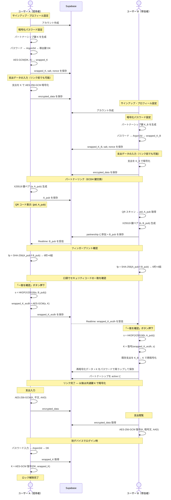

# Seppan

2人のパートナー間での割り勘・立て替え管理アプリ。支出データはエンドツーエンド暗号化（E2EE）で保護され、サーバーを含む第三者が平文データにアクセスすることはできません。

## 機能

- パートナー間の支出記録・割り勘計算
- カテゴリ別の支出管理
- QR コードによるパートナーリンク
- エンドツーエンド暗号化による支出データの保護

## 技術構成

| レイヤー       | 技術                                               |
| -------------- | -------------------------------------------------- |
| フレームワーク | Flutter                                            |
| バックエンド   | Supabase (PostgreSQL, Auth, Realtime, RLS)         |
| 暗号化         | cryptography (AES-256-GCM, Argon2id, X25519, HKDF) |
| 鍵キャッシュ   | flutter_secure_storage                             |

## 暗号化 & 鍵交換フロー



## E2EE 設計

### 暗号化対象

支出の機密フィールド（`amount`, `currency`, `ratio`, `category`, `memo`）を JSON にまとめ、AES-256-GCM で暗号化します。`id`, `partnership_id`, `paid_by`, `date` などのメタデータは暗号化しません（クエリ・ソート・RLS に必要なため）。

### 暗号文フォーマット

```
base64( nonce[12bytes] || ciphertext || tag[16bytes] )
AAD = "$expenseId:$partnershipId"
```

AAD（Additional Authenticated Data）に expense ID と partnership ID をバインドすることで、暗号文のコピペ攻撃を防止します。

### 鍵管理

```
パートナーシップ鍵 K (AES-256, 32bytes)
  │
  ├─ ユーザー A のパスワード
  │   → Argon2id (memory=64MB, iterations=3) → 導出鍵 DK_A
  │   → AES-GCM(key=DK_A, plaintext=K) → wrapped_K_A
  │   → サーバーに保存: wrapped_K_A, salt_A, nonce_A
  │
  └─ ユーザー B のパスワード
      → Argon2id → 導出鍵 DK_B
      → AES-GCM(key=DK_B, plaintext=K) → wrapped_K_B
      → サーバーに保存: wrapped_K_B, salt_B, nonce_B
```

- サーバーは暗号文とラップ済み鍵のみを保持し、平文の鍵 K やパスワードには一切アクセスできません
- デバイスローカルでは `flutter_secure_storage` に鍵をキャッシュし、毎回のパスワード入力を不要にします
