# Seppan 開発者ガイド

2人のパートナー間での割り勘・立て替え管理アプリ。支払いデータはクライアント側で E2E 暗号化され、サーバーには暗号文のみが保存される。

---

## 技術スタック

| レイヤー       | 技術                                  | 役割                                      |
| -------------- | ------------------------------------- | ----------------------------------------- |
| フレームワーク | Flutter (Dart 3.11+)                  | クロスプラットフォーム UI                 |
| バックエンド   | Supabase                              | PostgreSQL, 認証, Realtime, RLS           |
| 状態管理       | Riverpod 3.0 + riverpod_generator     | コード生成ベースのリアクティブ状態管理    |
| データモデル   | Freezed + json_serializable           | イミュータブルモデル + JSON 変換          |
| ルーティング   | go_router                             | 宣言的ルーティング, ディープリンク対応    |
| E2E 暗号化     | cryptography + flutter_secure_storage | AES-256-GCM, X25519, Argon2id             |
| 認証           | google_sign_in + Supabase Auth        | Google ネイティブ, Apple (iOS), Email OTP |
| アナリティクス | Firebase Analytics                    | スクリーントラッキング                    |
| チャート       | fl_chart                              | カテゴリ別集計の可視化                    |

---

## アーキテクチャ概要

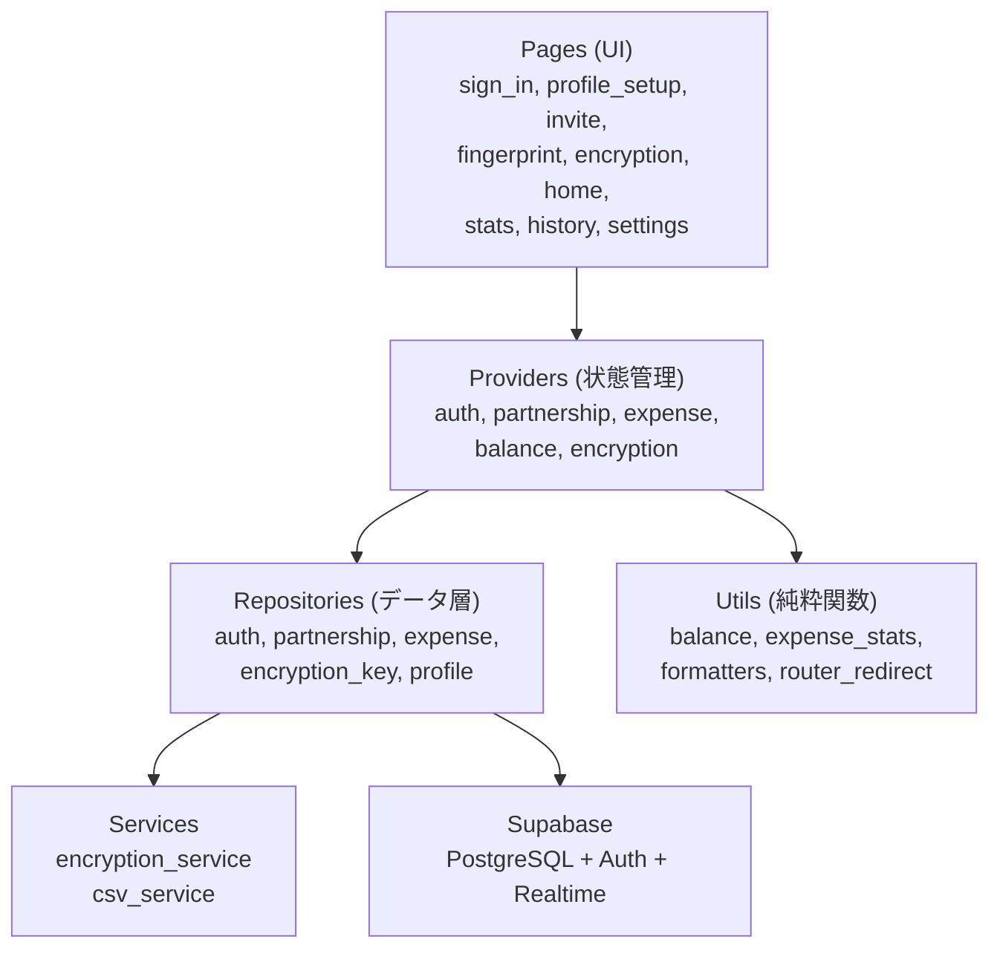

**レイヤーのルール:**

- Pages は Providers のみを参照し、Repositories や Services を直接呼ばない（例外: 暗号化フロー）
- Providers は Repositories を参照し、ビジネスロジックは Utils に委譲する
- Repositories は Supabase と直接通信し、暗号化/復号を内部で透過的に行う
- Services と Utils は外部依存を持たない純粋な関数群

---

## ディレクトリ構成

```
lib/
├── main.dart                   # エントリポイント (Firebase/Supabase 初期化)
├── app.dart                    # MaterialApp.router ラッパー
├── config/
│   ├── supabase.dart           # Supabase クライアント初期化
│   ├── theme.dart              # Material 3 テーマ定義
│   └── router.dart             # GoRouter ルート定義 + リフレッシュロジック
├── models/                     # Freezed イミュータブルモデル
│   ├── expense.dart            # 支払い (復号済みの状態)
│   ├── partnership.dart        # パートナーシップ (ECDH鍵含む)
│   ├── profile.dart            # ユーザープロフィール
│   └── category.dart           # カテゴリ
├── providers/                  # Riverpod プロバイダー
│   ├── auth_provider.dart      # 認証状態, ユーザー, プロフィール
│   ├── partnership_provider.dart # パートナーシップ, パートナー情報
│   ├── expense_provider.dart   # 支払いデータ (暗号化鍵注入)
│   ├── balance_provider.dart   # 残高計算, カテゴリ集計
│   └── encryption_provider.dart # 暗号化鍵ライフサイクル管理
├── repositories/               # データアクセス層
│   ├── auth_repository.dart    # 認証操作 (Google/Apple/Email)
│   ├── partnership_repository.dart # パートナーシップ CRUD
│   ├── expense_repository.dart # 支払い CRUD (暗号化透過)
│   ├── encryption_key_repository.dart # ラップ鍵の保存/取得
│   └── profile_repository.dart # プロフィール CRUD
├── services/                   # ビジネスロジック
│   ├── encryption_service.dart # 暗号化操作 (AES, ECDH, Argon2id)
│   └── csv_service.dart        # CSV エクスポート/インポート
├── utils/                      # 純粋関数ユーティリティ
│   ├── router_redirect.dart    # ルーターリダイレクト状態機械
│   ├── balance.dart            # 残高計算
│   ├── expense_stats.dart      # 月別集計/カテゴリ集計
│   ├── formatters.dart         # 日付/通貨フォーマット
│   └── reorder.dart            # リスト並び替え
├── pages/                      # 画面
│   ├── loading_page.dart       # 起動時ローディング画面
│   ├── auth/                   # 認証・暗号化フロー
│   ├── home/                   # ホーム (ダッシュボード)
│   ├── stats/                  # 統計
│   ├── history/                # 履歴 (マルチセレクト対応)
│   ├── expense_input/          # 支払い入力
│   ├── settings/               # 設定
│   └── shell/                  # BottomNavigationBar シェル
└── widgets/                    # 共通ウィジェット
```

---

## E2E 暗号化アーキテクチャ

### 暗号化の対象

| フィールド                                    | 暗号化 | 備考                                    |
| --------------------------------------------- | ------ | --------------------------------------- |
| amount, currency, ratio, category, memo       | 暗号化 | `encrypted_data` カラムに base64 で保存 |
| id, partnership_id, paid_by, date, created_at | 平文   | インデックス/クエリに必要               |

### 使用アルゴリズム

| 用途               | アルゴリズム              | 備考                           |
| ------------------ | ------------------------- | ------------------------------ |
| 支払いデータ暗号化 | AES-256-GCM               | AAD: `expenseId:partnershipId` |
| パートナー間鍵交換 | X25519 ECDH + HKDF-SHA256 | 共有秘密鍵でラップ/アンラップ  |
| パスワード鍵導出   | Argon2id (64MB, 3回)      | AES-GCM でラップ/アンラップ    |
| ローカルキャッシュ | flutter_secure_storage    | hex エンコードで保存           |

### 鍵の保存場所

| 保存場所                   | 内容                                        | キー名                        |
| -------------------------- | ------------------------------------------- | ----------------------------- |
| メモリ (Riverpod)          | 生の AES-256 パートナーシップ鍵             | `EncryptionKeyNotifier.state` |
| ローカル (SecureStorage)   | 生の鍵の hex エンコード                     | `partnership_key_{pid}`       |
| サーバー (encryption_keys) | Argon2id でラップされた鍵 + ソルト + ナンス | -                             |

### 暗号文フォーマット

```
base64( nonce[12bytes] || ciphertext || tag[16bytes] )
AAD = "$expenseId:$partnershipId"
```

AAD（Additional Authenticated Data）に expense ID と partnership ID をバインドすることで、暗号文のコピペ攻撃（別の expense や partnership に暗号文を移動する攻撃）を防止する。

### 鍵管理の構造

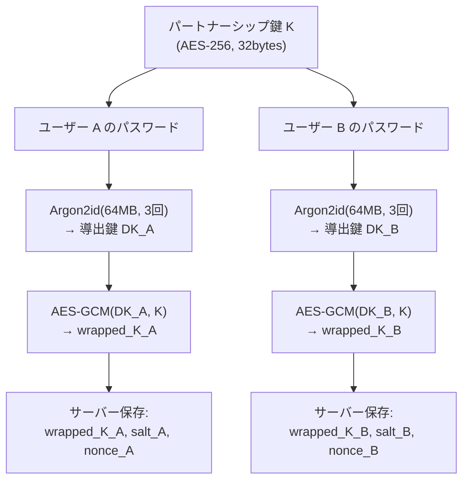

- サーバーは暗号文とラップ済み鍵のみを保持し、平文の鍵 K やパスワードには一切アクセスできない
- デバイスローカルでは `flutter_secure_storage` に鍵をキャッシュし、毎回のパスワード入力を不要にする

### 鍵交換の全体フロー

サインアップからリンク完了、日常利用までの完全なシーケンス:

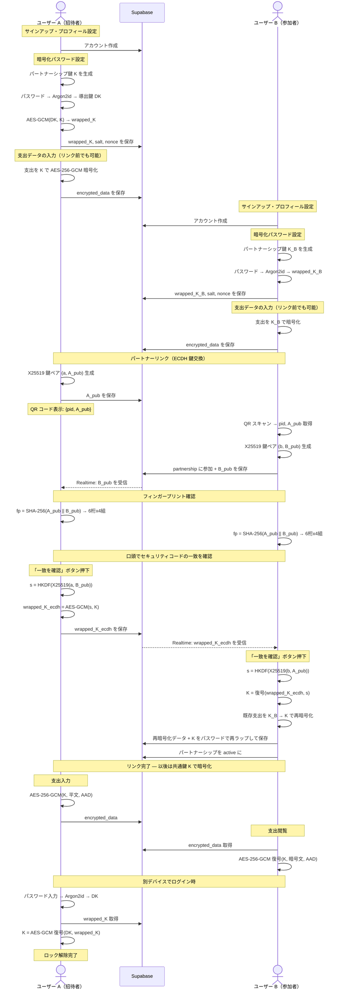

### 鍵復元フロー (アプリ再起動時)

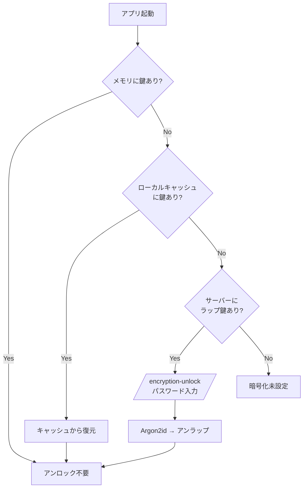

### クラッシュ耐性 (再暗号化)

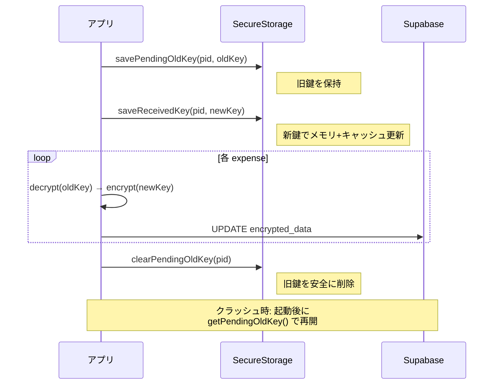

---

## 認証・ルーティングの状態機械

### ルーターリダイレクト

`router_redirect.dart` は純粋関数で、以下の優先順位でリダイレクトを決定する:

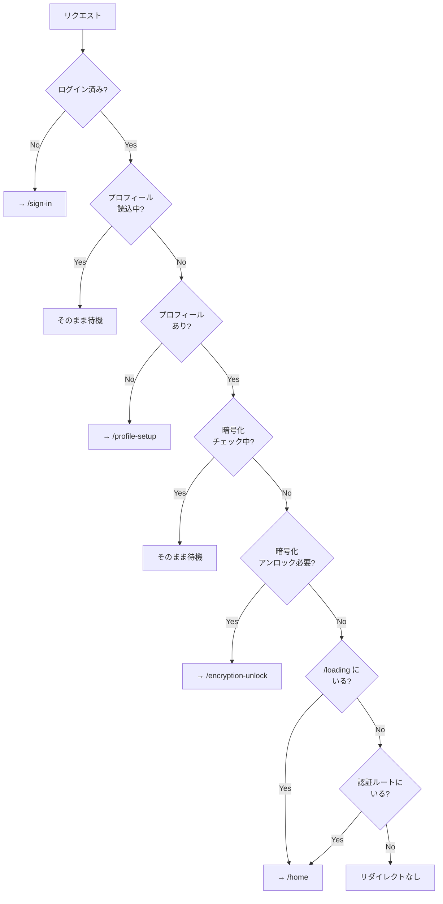

### GoRouter のリフレッシュ戦略

```dart
// NG: ref.watch → GoRouter 再構築 → ナビゲーションリセット
final goRouter = GoRouter(...); // 毎回新しいインスタンス

// OK: ref.listen + refreshListenable → GoRouter は1つのインスタンスを維持
final refreshNotifier = ValueNotifier<int>(0);
ref.listen(authStateChangesProvider, (_, __) => refreshNotifier.value++);
GoRouter(refreshListenable: refreshNotifier, ...);
```

プロフィール読込のリフレッシュは `loading → data/error` 遷移のみでトリガーし、
`invalidate` による `data → loading` ではトリガーしない（進行中のナビゲーションをキャンセルしないため）。

---

## データベース設計

### テーブル関係

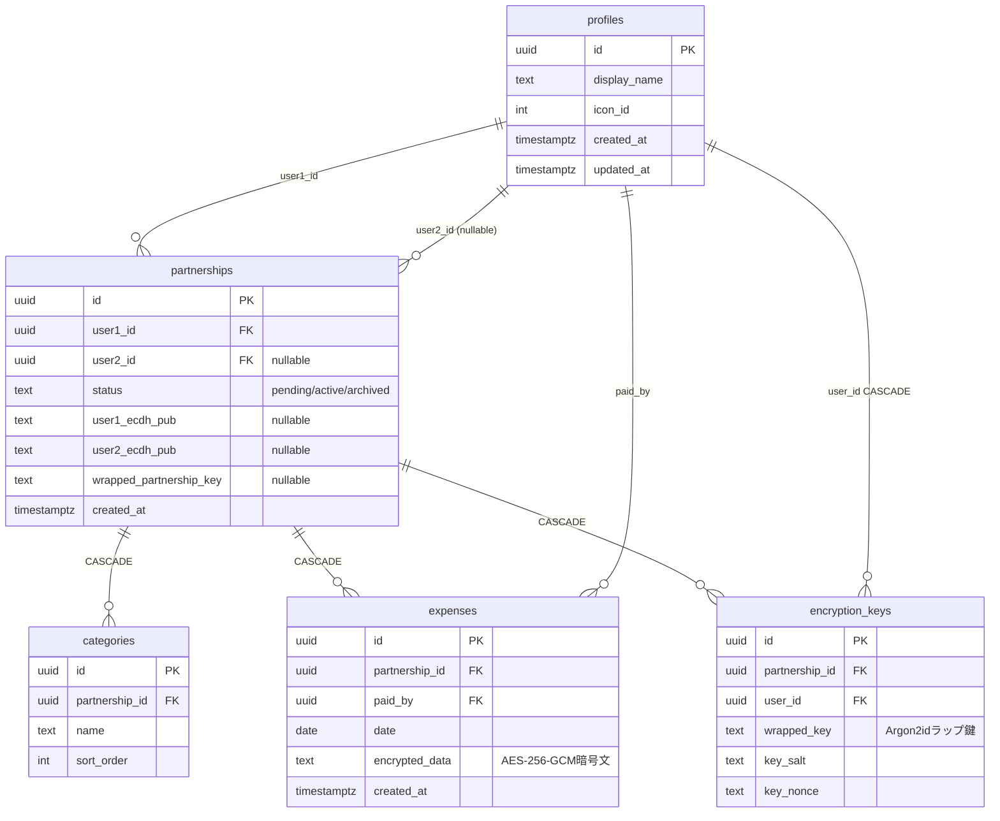

### RLS (Row Level Security)

全テーブルで RLS が有効。主なポリシー:

- **profiles**: 自分のプロフィールのみ CRUD 可能。パートナーのプロフィールは読み取りのみ
- **partnerships**: 自分が user1 または user2 のものだけ参照・更新可能。pending のパートナーシップは認証済みユーザーなら join 可能
- **expenses / categories**: パートナーシップのメンバーのみ CRUD 可能
- **encryption_keys**: 自分のキーのみ CRUD 可能

### アカウント削除

`delete_user_data` RPC は `SECURITY DEFINER` で RLS をバイパスし、FK 安全な順序でデータを削除:

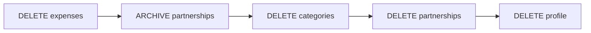

---

## 支払いデータのフロー

### 入力 → 暗号化 → 保存

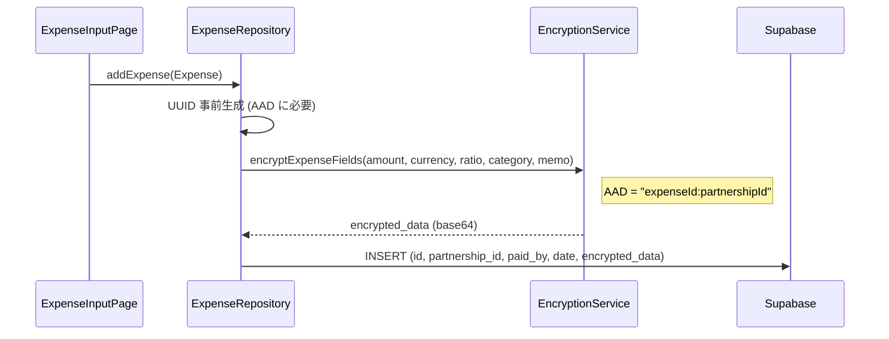

### 取得 → 復号 → 表示

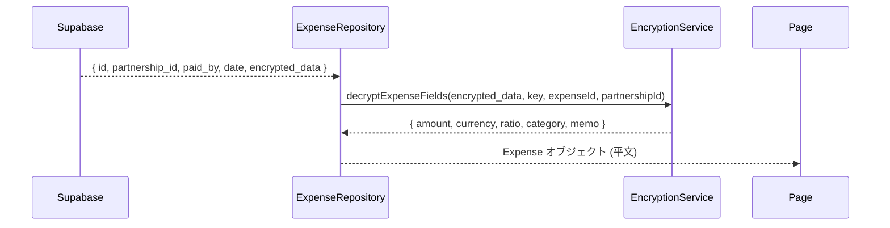

### 残高計算

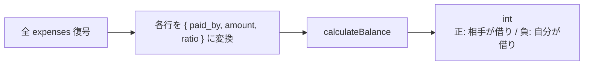

計算ロジック: 自分が払った → `+amount*(1-ratio)`, 相手が払った → `-amount*(1-ratio)`

---

## 画面遷移フロー

### 初回セットアップ

```mermaid
flowchart LR
    Loading[/loading/] --> SignIn[/sign-in/]
    SignIn --> Profile[/profile-setup/]
    Profile --> Home1[/home/<br/>未リンク状態]
    Home1 -->|リンクはこちら| Invite[/invite/]
    Invite --> EncSetup[/encryption-setup/<br/>パスワード設定]
    EncSetup --> Invite2[/invite/<br/>QR表示+待機]
    Invite2 -->|パートナーがQRスキャン| FP[/fingerprint-verification/<br/>双方で確認]
    FP --> Home2[/home/<br/>リンク完了]
```

### アプリ再起動

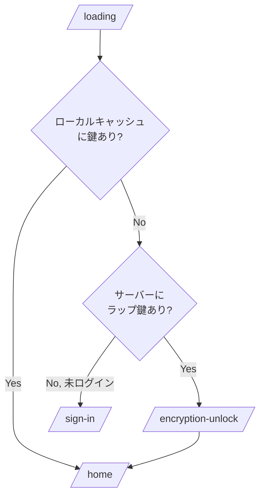

### メイン画面 (4タブ)

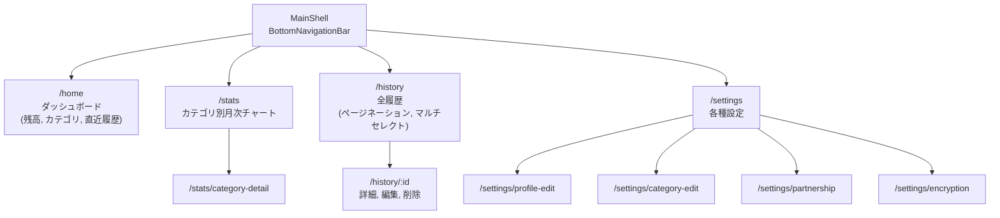

---

## プロバイダー依存グラフ

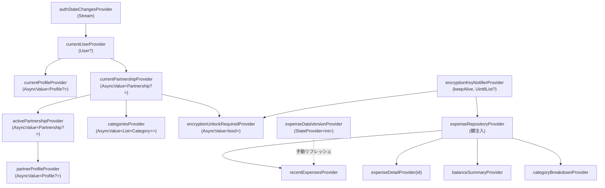

**`keepAlive: true`** は `EncryptionKeyNotifier` のみに適用。他のプロバイダーは `autoDispose` で、画面遷移時にメモリから解放される。

---

## コード生成

以下のコマンドでモデルとプロバイダーのコードを再生成する:

```bash
dart run build_runner build --delete-conflicting-outputs
```

生成されるファイル:

- `*.freezed.dart` — Freezed モデルの `copyWith`, `==`, `hashCode`, `toString`
- `*.g.dart` — JSON シリアライズ (`fromJson`/`toJson`) + Riverpod プロバイダー定義

`@riverpod` アノテーションから `*Provider` が生成される。手動で `Provider` クラスを書く必要はない。

---

## ビルドと実行

### 環境変数

`.env` ファイルに以下を定義:

```
SUPABASE_URL=https://xxx.supabase.co
SUPABASE_ANON_KEY=eyJ...
GOOGLE_WEB_CLIENT_ID=xxx.apps.googleusercontent.com
```

### デバッグビルド

```bash
flutter run --dart-define-from-file=.env
```

### リリースビルド (APK)

```bash
flutter build apk --release --dart-define-from-file=.env
```

### adb インストール

```bash
adb install build/app/outputs/flutter-apk/app-release.apk
```

---

## マイグレーション管理

Supabase CLI を使用。マイグレーションファイルは `supabase/migrations/` に SQL で管理。

### 新規マイグレーション

```bash
npx supabase migration new <名前>    # ファイル作成
# SQL を記述
npx supabase db push                 # リモートに適用
```

### 後方互換性ルール

- カラム追加は必ず `DEFAULT` または `NULL` 許容
- カラム削除・名前変更は行わない
- NOT NULL カラム追加時は必ず `DEFAULT` をつける
- テーブル追加は旧クライアントに影響しないため安全

---

## テスト

### テスト方針

- **純粋関数テスト**: `flutter_test` のみ使用。モッキングフレームワーク不使用
- **構造テスト**: ソースファイルを `dart:io` で読み、コードパターンの存在を `contains` / `indexOf` で検証

### テスト実行

```bash
flutter test
```

### テストファイル一覧

| ファイル                               | 種別     | テスト内容                              |
| -------------------------------------- | -------- | --------------------------------------- |
| `router_redirect_test.dart`            | 純粋関数 | ルーターリダイレクト状態機械 (36テスト) |
| `balance_calculation_test.dart`        | 純粋関数 | 残高計算 (各割合, エッジケース)         |
| `expense_stats_test.dart`              | 純粋関数 | 月次集計・カテゴリ集計                  |
| `encryption_service_test.dart`         | 純粋関数 | 暗号化ラウンドトリップ, AAD検証         |
| `csv_service_test.dart`                | 純粋関数 | CSV パース, バリデーション              |
| `formatters_test.dart`                 | 純粋関数 | フォーマッター                          |
| `reorder_test.dart`                    | 純粋関数 | リスト並び替え                          |
| `self_join_guard_test.dart`            | 構造     | セルフジョインガード                    |
| `fingerprint_race_guard_test.dart`     | 構造     | レースコンディションガード              |
| `bulk_delete_safety_test.dart`         | 構造     | 一括削除エラー処理                      |
| `reencrypt_key_preservation_test.dart` | 構造     | 再暗号化時の旧鍵保持                    |
| `csv_duplicate_detection_test.dart`    | 構造     | CSV 重複検知                            |
